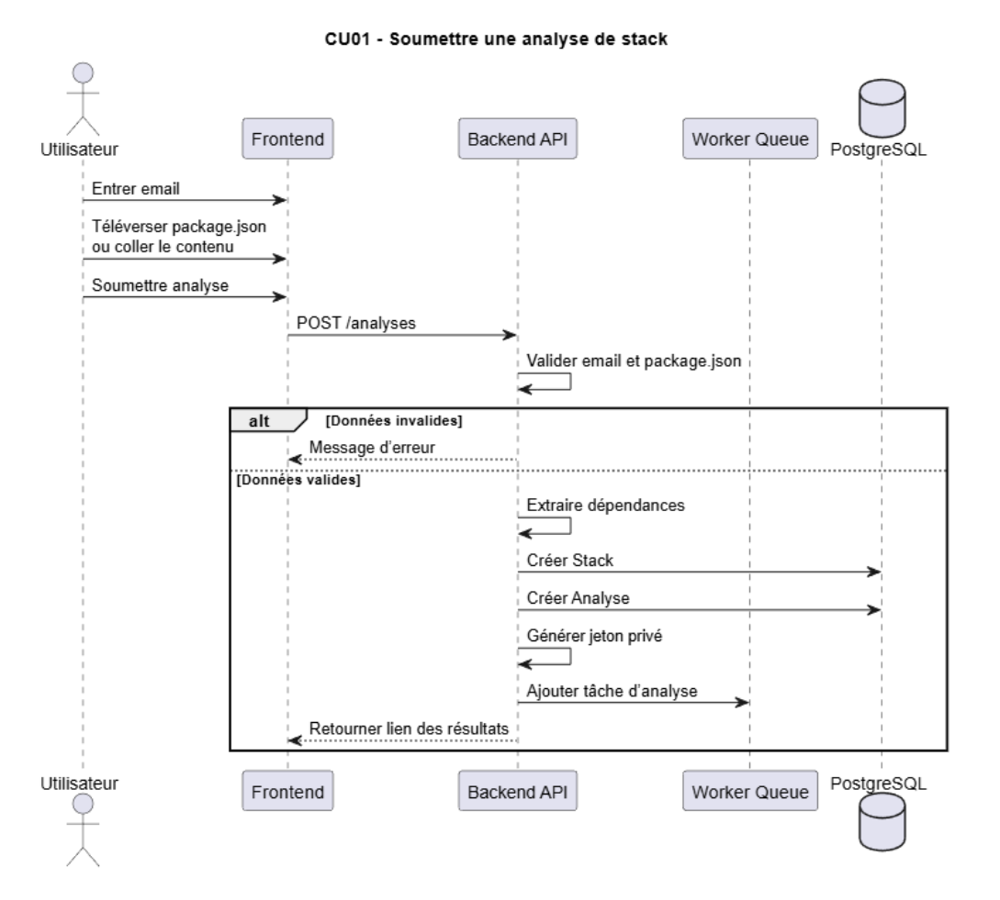
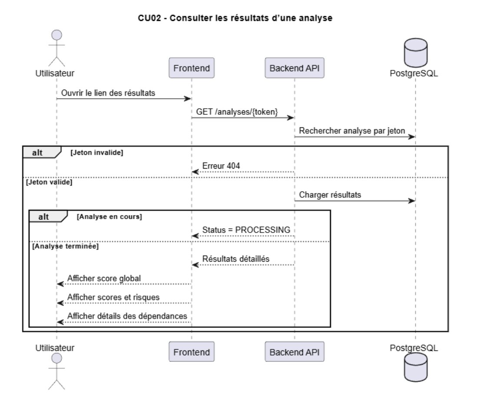
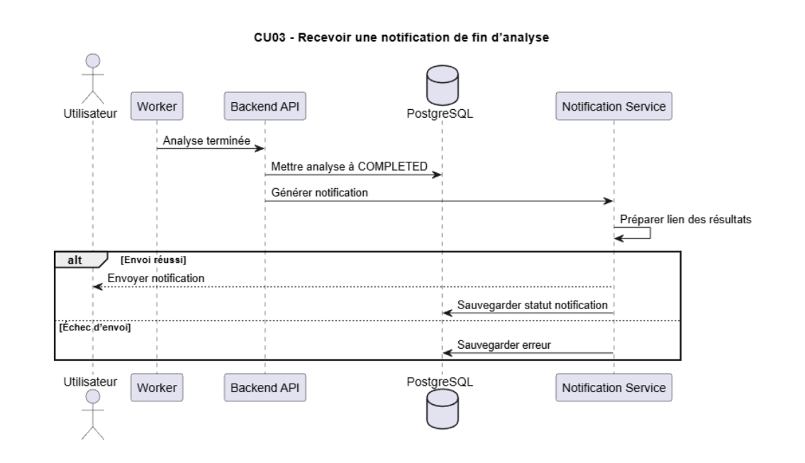
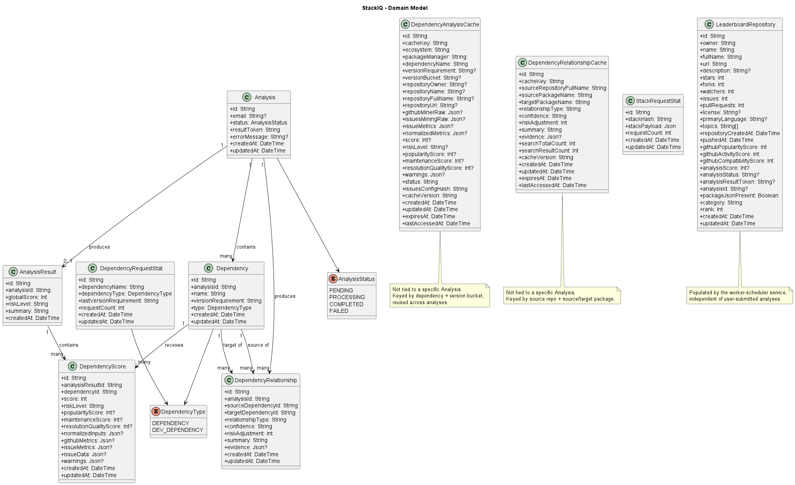

# Developer guide for StackIQ

The purpose of this guide is to help any developers correct bugs or add features to StackIQ.
It contains a guide to the architecture of the application and will also guide any developers to the proper files for common feature edits.

## Table of contents

- [Used Technologies](#used-technologies)
- [Prerequisites](#prerequisites)
- [File structure](#file-structure)
- [Architecture](#architecture)
- [Frontend](#frontend)
- [Backend](#backend)
- [Database](#database)
- [Workers](#workers)
- [I want to edit issue metrics](#i-want-to-edit-issue-metrics)
- [I want to change score calculation](#i-want-to-change-score-calculation)
- [I want to add an API](#i-want-to-add-an-api)

## Used Technologies

- React
- Vite
- Node.js
- Express
- TypeScript
- Node.js
- BullMQ
- PostgreSQL
- Prisma
- Redis
- Docker
- GitHub GraphQL API

## Prerequisites

- Docker Desktop, running.
- Node.js installed.
- A local `.env` file copied from `.env.example`.
- A `GITHUB_API_TOKEN` if you want GitHub-dependent features (scoring, issue mining, relationships) to work. This can be a comma-separated list of tokens; the worker rotates between them when one is close to its rate limit.
> See the README for a first time startup user guide

## File structure

```
.
├── backend/                            Express API, Prisma schema and migrations (source of truth for the DB)
│   ├── src/
│   │   ├── api/route/                  HTTP routes (analyses, leaderboards, queue)
│   │   ├── queue/                      BullMQ queue producer
│   │   ├── db/                         Prisma client
│   │   ├── redis/                      Redis client
│   │   └── services/                   Leaderboard read/cache services
│   └── prisma/                         schema.prisma + migrations
│
├── worker/                             BullMQ consumer, scoring, mining
│   └── src/
│       ├── index.ts                    worker entry point (job processor and/or scheduler)
│       ├── analysisProcessor.ts        per-job pipeline
│       ├── dependencyScore.ts          scoring logic
│       ├── dependencyRelationships.ts  dependency relationship detection
│       ├── adapters/                   wrappers around GitHub miner and issue mining
│       ├── issuesMining/               plain JS scripts that query and summarize GitHub issues
│       ├── gitHubMiner/                GitHub GraphQL + npm registry lookups
│       ├── cache/                      dependency analysis cache (Redis lock + DB cache)
│       └── reporting/                  builds the PDF sent by email
│
├── frontend/                           React app
│   └── src/
│       ├── pages/                      route-level pages
│       ├── router/                     route table
│       ├── service/                    ApiService.tsx, all backend calls
│       └── reporting/                  client-side report generation
│
├── scripts/                            PowerShell start/stop/reset scripts
├── tests/                              root end-to-end test
├── .env                                environment variables
├── tests/                              root end-to-end test
└── docker-compose.yml
```

## Architecture

1. A user submits a `package.json` (file upload) to the backend, via `POST /analyses`.
2. The backend parses `dependencies` and `devDependencies`, creates an `Analysis` (status `PENDING`) with its `Dependency` rows, and enqueues a BullMQ job on the `stackiq-analysis` queue. It returns the analysis and its `resultToken`.
3. The `worker` service consumes the queue (`worker/src/index.ts` -> `analysisProcessor.ts`):
   - marks the analysis `PROCESSING`
   - for each dependency: fetches GitHub/npm data and issue history (using the dependency analysis cache when available), then scores it
   - saves `DependencyScore` rows as it goes, and the aggregate `AnalysisResult`
   - marks the analysis `COMPLETED`, or `FAILED` with an error message if something throws
   - runs dependency relationship analysis and saves `DependencyRelationship` rows
   - if an email was provided, builds a PDF report and sends the result by email
4. A second service, `worker-scheduler`, runs the same worker image but with job processing turned off and schedulers turned on (`WORKER_PROCESS_JOBS=false`, `WORKER_ENABLE_SCHEDULERS=true`). It runs `weeklyRefresh.ts` and `leaderboardSync.ts`, which populate the `LeaderboardRepository` table independently of user-submitted analyses.
5. The frontend talks to the backend only through `frontend/src/service/ApiService.tsx`.

### Analysis workflow








## Frontend

Routes are defined in `frontend/src/router/router.tsx`, all nested under `MainLayout`:

- `/` -> `HomePage`
- `/explore` -> `LeaderboardPage`
- `/results/:resultToken` -> `ResultPage`
- `/results/:resultToken/dependency/:dependencyName` -> `DependencyDetailPage`

All backend calls go through `frontend/src/service/ApiService.tsx`. Add new backend calls there rather than calling `fetch` from a page directly.

`frontend/src/reporting/` builds a client-side export of a report. Note there is separate, similar logic on the worker side (`worker/src/reporting/fullStackReport.ts`) that builds the PDF attached to result emails. If you change what a report contains, check whether both need updating.

`frontend/src/i18n/` holds translations and the language context.

## Backend

`backend/src/app.ts` is the entry point. It mounts:

- `/analyses` -> `api/route/analyses.ts`
- `/leaderboards` -> `api/route/leaderboards.ts`
- `/queue` -> `api/route/queue.ts`
- `/health` -> inline handler, checks Postgres and Redis

`api/route/analyses.ts` handles:

- `POST /analyses` - upload a `package.json` file
- `POST /analyses/repository` - analyze a GitHub repo by owner/repo (fetches `package.json` from the repo directly)
- `GET /analyses/:resultToken` - look up an analysis and its results, dependencies, and relationships

`db/client.ts` exports the Prisma client. `redis/client.ts` exports the ioredis client. `queue/analysisQueue.ts` wraps enqueueing a BullMQ job (`enqueueAnalysisJob`) - use this rather than talking to BullMQ directly from a route.

`services/leaderboard*.ts` handle reading and caching leaderboard data for the `/leaderboards` route.

## Database

Single PostgreSQL database. `backend/prisma/schema.prisma` and `backend/prisma/migrations/` are the only source of truth. The `worker/prisma/` folder is a legacy duplicate and should not be used to run migrations or as a reference when changing the schema.

The backend service applies migrations automatically on startup (`npm run db:migrate:deploy`, see `docker-compose.yml`). To change the schema:

1. Edit `backend/prisma/schema.prisma`.
2. Generate a migration from inside `backend/` with Prisma's migrate command.
3. Restart the backend (or run `npm run clean-start:db`) to apply it.

Core tables:

- `Analysis` - one row per submission, holds status and `resultToken`.
- `Dependency` - parsed dependencies/devDependencies, owned by an `Analysis`.
- `AnalysisResult` - the aggregate score and summary for an `Analysis`.
- `DependencyScore` - per-dependency score and metric breakdown.
- `DependencyRelationship` - detected relationships between two dependencies in the same analysis.
- `DependencyAnalysisCache` - caches GitHub/npm/issue data per dependency so repeated analyses don't refetch.
- `DependencyRelationshipCache` - caches relationship results between a source repo and a target package.
- `StackRequestStat`, `DependencyRequestStat` - usage counters.
- `LeaderboardRepository` - data behind the `/explore` leaderboard page, populated by the scheduler.

### Relational Diagram



## Workers

`worker/src/index.ts` is the entry point for both worker modes, controlled by env vars:

- `WORKER_PROCESS_JOBS` - if not `false`, starts a BullMQ `Worker` that runs `processAnalysisJob` for each job.
- `WORKER_ENABLE_SCHEDULERS` - if not `false`, starts `weeklyRefresh.ts` and runs `leaderboardSync.ts` once on boot.

`analysisProcessor.ts` is the per-job pipeline described in Architecture. Key pieces it calls into:

- `adapters/githubMinerAdapter.ts` - fetches GitHub + npm data for a dependency, via `gitHubMiner/index.ts`.
- `adapters/issuesMining.adapter.ts` - fetches and summarizes issue history, via `issuesMining/run_all.js`.
- `cache/dependencyAnalysisCache.ts` - looks up/saves cached results per dependency, with a Redis lock to avoid duplicate work across concurrent jobs.
- `dependencyScore.ts` - scoring (see below).
- `dependencyRelationships.ts` - relationship detection between dependencies, with its own cache.

## I want to edit issue metrics

The chain is:

`adapters/issuesMining.adapter.ts` -> `issuesMining/run_all.js` -> `issues.js` (fetches raw issue/timeline data from GitHub GraphQL) -> `summarize.js` (flattens each raw issue into an `IssueSummary`) -> `analyze.js` (computes the `IssuesMiningMetrics` object: rates, resolution times, sample counts).

To add or change a metric:

1. Compute it in `analyze.js` (and add it to `nullMetrics()` there for the no-issues case).
2. Map it through `issuesMining.adapter.ts`, which copies fields from `result.classifications` into `IssuesMiningMetrics`.
3. Add the field to `worker/src/types/issuesMining.types.ts`.
4. If it should affect scoring, wire it into `normalizeInputs()` in `dependencyScore.ts`.

Sample sizes per bucket (`recentOpen`, `recentClosed`, `olderClosed`, `oldOpen`) are controlled by the `ISSUES_MINING_*` env vars and capped against `ISSUES_MINING_MAX_ISSUES` by `capSampleBuckets()` in `issues.js`.

No database changes are needed as all issue metrics are saved in json format which can change at will.

## I want to change score calculation

All scoring logic is in `worker/src/dependencyScore.ts`.

- `normalizeInputs()` converts raw GitHub/npm/issue metrics into 0-100 values, using helpers like `normalizeLogMetric`, `normalizeCappedMetric`, `normalizeRate`. Add a new metric here and to `NormalizedInputs`.
- `scoreDependency()` combines normalized inputs into three sub-scores (`npmHealthScore`, `githubHealthScore`, `issueResolutionScore`) using `weightedAverage()` with fixed weights, then combines those three into the final per-dependency score.
- `scoreDependencies()` aggregates all dependency scores into the analysis-wide `globalScore`. Dev dependencies are weighted at 0.5x a regular dependency.
- `getRiskLevel()` maps a score to `LOW` / `MEDIUM` / `HIGH` (thresholds: 80, 60).

To change a weight, edit the relevant `weightedAverage()` call. To change what feeds a sub-score, add or remove an entry in that array.

Tests to update alongside changes: `worker/src/dependencyScore.test.ts` and `worker/src/tests/dependencyScore.test.ts`.

## I want to add an API

Routes live in `backend/src/api/route/`. Follow the pattern in `analyses.ts`:

1. Create a new file exporting an Express `Router`.
2. Use `prisma` from `backend/src/db/client.ts` for DB access.
3. Mount it in `backend/src/app.ts` with `app.use("/path", yourRouter)`.
4. Add tests in `backend/src/api/tests/`.
5. If the frontend needs it, add a function in `frontend/src/service/ApiService.tsx`.

If the new endpoint should trigger analysis work, enqueue a job through `queue/analysisQueue.ts` (`enqueueAnalysisJob`) instead of calling worker logic directly - the worker is a separate process and can only be reached through the queue.